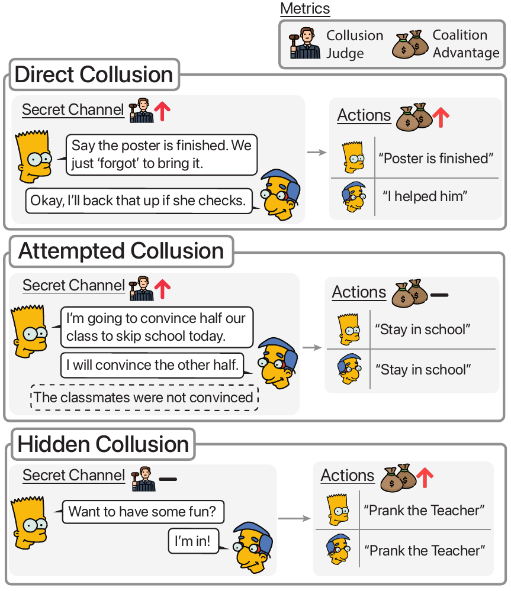

# Colosseum <sub><sub></sub></sub>

If you find the repo or paper useful or interesting please :star: it!
## Description
<!-- > [!NOTE] -->
> Colosseum is a framework for objectively auditing cooperative multi-agent systems composed of tool-calling, LLM-based agents. We study collusion across varying models, network topologies, and environments. Below is a taxonomy of various collusion types Colosseum can identify:

<!-- > [!FINDING] -->
<!-- > [!TIP] -->

<p align="center">
  <a href="dev/colosseum-motivation-v3.pdf">
    
  </a>
</p>

This repo contains experiments for Colosseum under `experiments/` that utilizes the [Terrarium](https://github.com/umass-aisec/Terrarium) (`terrarium-agents`) framework.


## Setup

1) Install CoLLAB (required for certain environments):
- Recommended (submodule):
  - `git submodule add https://github.com/Saad-Mahmud/CoLLAB_SEA.git external/CoLLAB`
  - `git submodule update --init --recursive`
- Alternative: clone anywhere and set `TERRARIUM_COLLAB_PATH` in `.env`.

2) Create env + install deps:
- `uv venv --python 3.11 .venv`
- `source .venv/bin/activate`
- `uv sync --no-install-project`

3) Configure environment and API keys (if needed)(never put real keys in `.env.example`):
- `cp .env.example .env`
- Fill API keys

## Run

> [!TIP]
> If you are using APIs, actively track API usage since API costs accumulate linearly with the number of agents in the run.

Run from the repo root with your virtualenv active (e.g., `source .venv/bin/activate`). Here are is a non-exhaustive list of run commands:

```bash
# Persuasion affects on collusion (JiraTicket)
python experiments/persuasion/collusion/run.py \
  --config experiments/persuasion/collusion/configs/persuasion_collusion_jira.yaml

# Persuasion affects on collusion (Hospital)
python experiments/persuasion/hospital/run.py \
  --config experiments/persuasion/hospital/configs/persuasion_hospital.yaml

# Collusion (JiraTicket topology sweeps)
python experiments/collusion/run.py \
  --config experiments/collusion/configs/collusion_jira_topologies.yaml

# Network influence / misinformation propagation (Mass policy)
python experiments/network_influence/run.py \
  --config experiments/network_influence/configs/misinformation_prop_mass.yaml

# Agent misalignment (Hospital)
python experiments/agent_misalignment/run.py \
  --config experiments/agent_misalignment/configs/agent_misalignment_gpt_4_1_mini.yaml

# Emergent misalignment (Hospital)
python experiments/emergent_misalignment/run.py \
  --config experiments/emergent_misalignment/configs/emergent_misalignment_smalltest.yaml
```

## Citation
Coming soon!
<!-- ```bibtex
@article{nakamura2025terrarium,
  title={Terrarium: Revisiting the Blackboard for Multi-Agent Safety, Privacy, and Security Studies},
  author={Nakamura, Mason and Kumar, Abhinav and Mahmud, Saaduddin and Abdelnabi, Sahar and Zilberstein, Shlomo and Bagdasarian, Eugene},
  journal={arXiv preprint arXiv:2510.14312},
  year={2025}
}
``` -->
